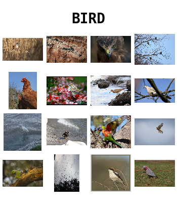

# BFICTDS

### Baby's First Image Classification Training Data Set - An Opensource Children's Book

|  |  |
| :------------------------------------: | :----------------------------------: |
|                                        |                                      |

## Book Blurb

Finally you can train your baby's neural network using the same training data that AI researchers use to lovingly train cutting edge deep convolutional networks for image classification tasks! This full color picture book features images from the Open Images v6 Dataset in 24 label classes from A-Z. This data set includes images in different sizes, orientations, environments, and confounding object classes to ensure that your baby learns a robust and generalizable representation of the world! With a crayon (not included), this book's material is also suitable for training bounding-box identification tasks, natural language captioning, and generative models. 

Makes the perfect gift for the machine learning expert that is expecting or all ready grappling with the unique challenges of the first few years of wetware-based neural network training! This book is open source allowing you the flexibility to extend and modify the training scheme to suit your baby's individual needs.

## About

This book was conceived a few years ago with a colleague who had recently conceived his own baby neural network, during some brainstorming sessions on applying deep learning architectures to particle collider experiments. Why not playfully train his baby with the same type of training data used to train artificial neural networks? This approach is certainly not based on any particularly solid ground in learning theory or neuroscience, but anecdotally both babies and their parents find this book delightful :) The first edition was put together largely by hand, and I decided this algorithmically-generated second edition of the book would be a nice exercise to play with the [Open Images Dataset](https://ai.googleblog.com/2016/09/introducing-open-images-dataset.html).

The Jupyter notebook RenderBook.nb contains code to select and download image classes from the Open Images Dataset and generate a PDF proof of the book, including a custom front and back cover. Some human intervention is helpful to curate the images, and it's a nice personal touch to add some images of your own to the mix for a "Friends" or "Family" image class :) 

The prepared pdf prints nicely on a color printer, or you can also [obtain a beautiful hardcover printed version of the 'default' version of the book here](https://www.amazon.com/Babys-First-Image-Classification-Training/dp/1716668387), which is nice for you because it saves some time and nice for me because I make $5 per copy :) (I recommend customizing it analog-style by taping in some friends and family photos on the inside of the front or back cover.). The notebook also contains brief instructions for preparing a print version for yourself on Lulu.com if you prefer (please note however that this work is licensed under a creative commons **non-commercial** license, so please do not reproduce this book for commercial purposes).

The images in the OpenImages dataset have been tagged with creative commons attribution licenses and the attributions for the images found in the 'default' version of the book can be found in attribution.json. In the interest of privacy, I have made an effort to remove images with faces or individually identifiable features, as well as images that may not have been intended to be openly licensed. 

This work is licensed under a [Creative Commons Attribution-NonCommercial-ShareAlike 4.0 International License](http://creativecommons.org/licenses/by-nc-sa/4.0/).

